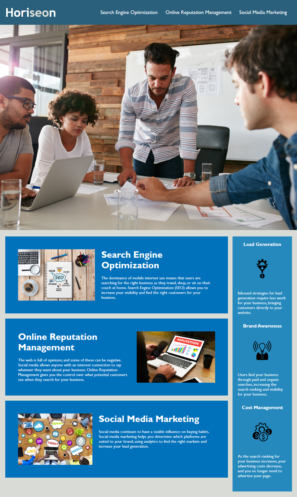

# Accessibility-Challenge

## Link to Deployed Application

## Description
This initiative centers on improving the accessibility standards and performance of a marketing agency's website. The key goal is to refine the codebase by integrating semantic HTML elements, ensuring content clarity for both users and assistive technologies. Emphasis is also placed on maintaining a logical structure independent of styling, promoting adaptability and scalability. This strategic approach aligns with current accessibility standards while preparing the website for future developments in web development practices.

## Screenshot

